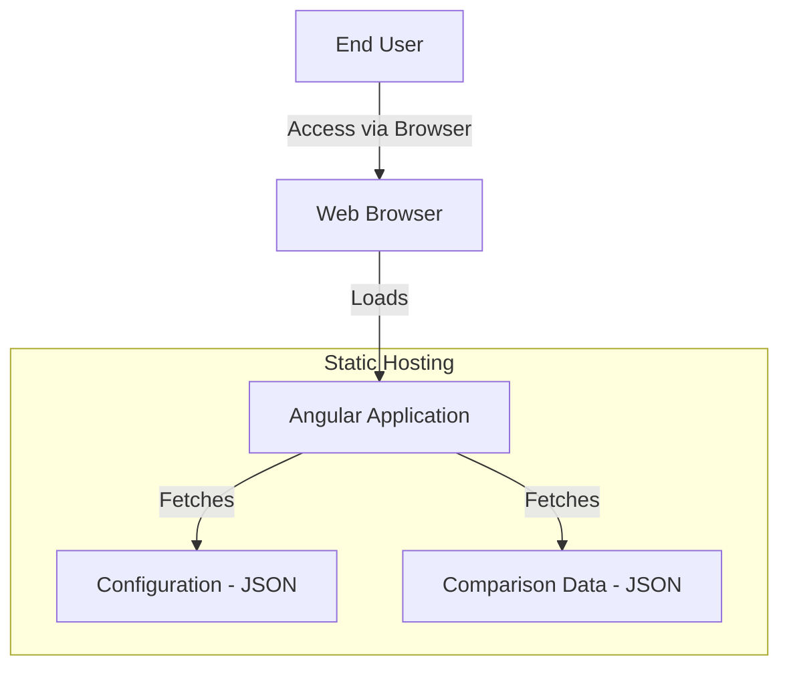
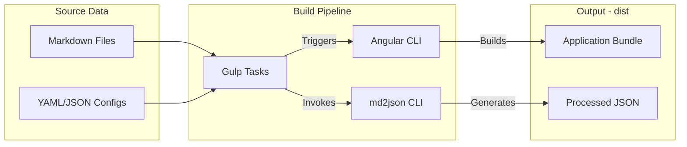
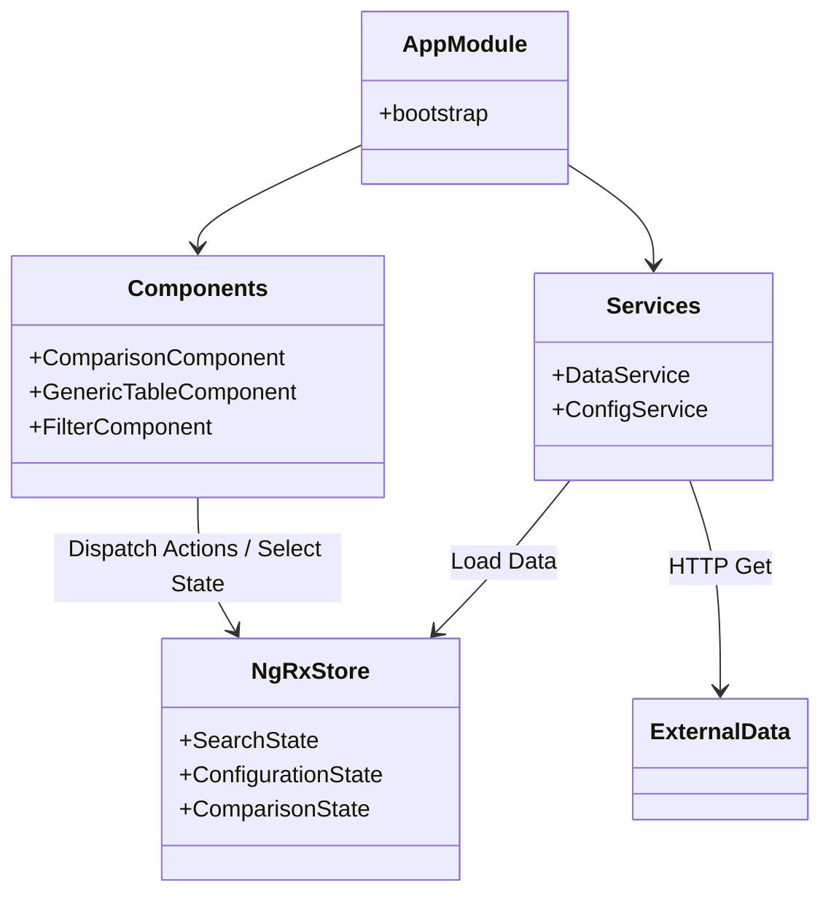
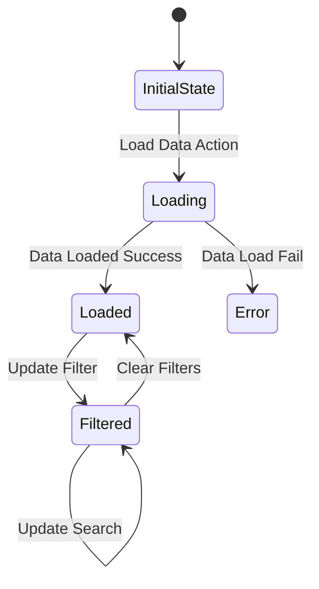
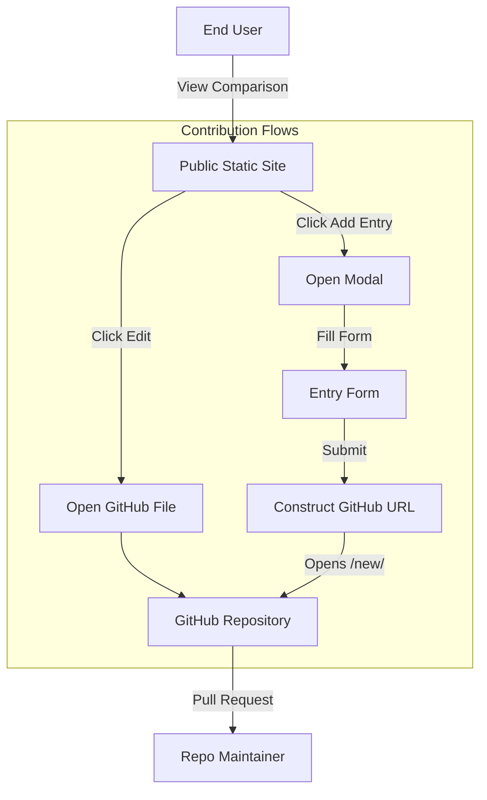
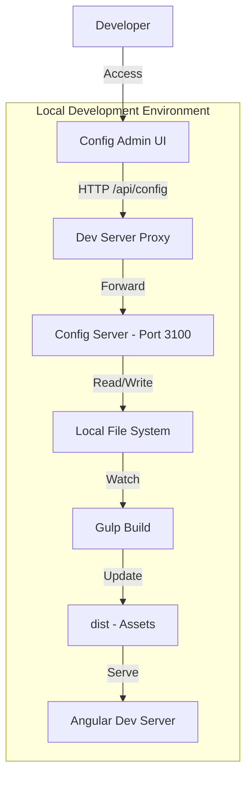

# System Architecture

## Overview
This document visualizes the high-level architecture, build process, and data flow of the **Ultimate Comparisons** application.

> Note: These diagrams are generated using Mermaid. GitHub natively renders these diagrams.

## System Context
The application is a client-side Angular application that runs entirely in the browser (static deployment). It consumes pre-processed data files generated during the build process.

## Build Process (Data Pipeline)
The project uses a Gulp-based pipeline to transform raw Markdown data into JSON consumed by the Angular application.

## Application Architecture
The application follows a standard Angular modular architecture with NgRx for state management.

## State Management (NgRx)
State is managed using NgRx with immutable updates and memoized selectors.

## User Contribution Flows
The public application allows users to contribute by creating new entries or editing existing ones via GitHub integration.

## Configuration Admin Interface
The repository includes a local-only admin interface for editing configuration files during development. This connects to a local Node.js server.

## Key Technologies
- **Angular 21**: Core framework
- **NgRx 20**: State management (Store, Effects)
- **TypeScript 5.9**: Language
- **Gulp 4**: Task runner for data processing
- **md2json**: Custom tool for Markdown to JSON conversion
